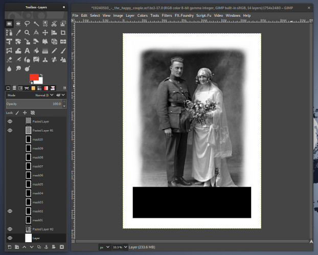

# DIY Time Line cards game

This is a collection of helpers to create a [Timeline][time-line]-like
game.

It is not related in any way to the original Timeline game.

[time-line]: https://www.zygomatic-games.com/en/game/timeline-classic/

## Introduction

In 2016, one of my sisters proposed to craft a gift for our parents
coinciding with their 50th wedding anniversary that would work as a
photo album, but more fun. She proposed that we would make our own
game with family pictures following the same idea than Timeline.

During those years, Timeline was a popular cards game with a very
simple mechanic. Each card pictures an event happening in a very
specific moment in time. In one side, the card only states the name of
the event while in the other side of the card it reveals the year that
event happened and, sometimes, further details about the event.

The game consists in placing those cards in a time line from the
further past to the present. Hence, its name. Additionally, the game
was visually beautiful and, at the time, was done with quality
materials in a nice embossed tinbox.

We decided to follow the same style but, since we wanted it to work as
a photo album, the cards would be A5 instead of the tiny size of the
original game. My sisters did the heavy work of finding the bulk of
the pictures while I created the artistic material and selected the
best pictures from the very big selection I received. In the end, we
expanded from 1942 to 2016, for more than 120 cards.

We would also need a place in which to store the cards. An embossed
tin box would have been great but way too expensive to the very
limited amount we wanted to order. In the end, we decided to order an
A5 [cookies box][cookies-box] from a provider which would be able to
print on the lid.

[cookies-box]: https://www.fotoregalosoriginales.es/caja-de-galletas.aspx

## Usage

The [src](src) directory contains raw art I used to create the rest of
the material.

In order to create a new game set we will use the files in the
[templates](templates) directory.

### Cards

First, we will use the
[background-picture.xcf.bz2](templates/background-picture.xcf.bz2) and
the
[cut-helper-background-picture.xcf.bz2](templates/cut-helper-background-picture.xcf.bz2)
files to create the background image of our cards.

With [GIMP][gimp], we'll open *background-picture.xcf.bz2*. This file
has several masks to chose a blurry border for our pictures. We will
copy our photo and add it as a new layer below the masks. Then, we'll
select the mask we want to use to apply the blurry border by making it
[visible][gimp-layer-properties] while keeping the rest of the masks
not visible. Then, we'll [scale][gimp-tool-scale] and
[move][gimp-tool-move] the new layer with our photo so it correctly
sits under the mask in a way that the main focus of the picture is
clearly visible.

The blurry border of the masks has several purposes:
- Gives the card a feeling of bringing up memories, events from the past.
- Allows easily sitting pictures in different aspect ratios.
- Fades the hard borders of the pictures.

Then, we will hide the top layer which is showing the bottom black box
representing the area that won't be visible in our card because other
objects will be on top. Once this is done, we can
[export][gimp-fileformats] our new card as a PNG picture.

The
[19240510_-_the_happy_couple.xcf.bz2](samples/19240510_-_the_happy_couple.xcf.bz2)
file is a sample in which the process described above has been done
taking the
[19240510_-_the_happy_couple.jpg](samples/19240510_-_the_happy_couple.jpg)
file as source photography.

We can also open with GIMP *cut-helper-background-picture.xcf.bz2*
which is a companion file for the *background-picture.xcf.bz2* one in
a way that we can use both simultaneously so
*cut-helper-background-picture.xcf.bz2* will help us to place our
photo in the best possible size and place in
*background-picture.xcf.bz2*.

Afterwards, we will open [card.sla.gz](templates/card.sla.gz) with
[Scribus][scribus].

We will add an [Image Frame][scribus-image-frame] into the first page
and load our newly created picture into it. Then, we will *Adjust
Frame to Image* and [move][scribus-moving-frames] it to the *x* 0.0
and *y* 0.0 coordinates taking the top left corner as reference (the
default). Then, we will *Level > Lower to Bottom* it. We'll repeat the
same steps in the second page.

Next, we will adjust the texts from the banners in the first and
second page. The font used for them is
[Ibarra Real Nova][ibarra-real-nova].

Finally, we'll export the document as a
[PDF X/3][scribus-pdf-x3]. Since I live in Europe, I've used the
[PSO Coated v3][pso-coated-v3] as the color profile for the export but
feel free to use the color profile that works best for your printing
service or just export as [PDF 1.4][scribus-pdf-flavors] or above if
you want to leave the election to them.

The
[19240510_-_the_happy_couple.sla.gz](samples/19240510_-_the_happy_couple.sla.gz)
file is a sample in which the process described above has been done
and
[19240510_-_the_happy_couple.pdf](samples/19240510_-_the_happy_couple.pdf)
is the resulting PDF X/3 file.

[gimp]: https://www.gimp.org/
[gimp-layer-properties]: https://docs.gimp.org/2.10/en/gimp-image-combining.html#gimp-layer-properties
[gimp-tool-scale]: https://docs.gimp.org/2.10/en/gimp-tool-scale.html
[gimp-tool-move]: https://docs.gimp.org/2.10/en/gimp-tool-move.html
[gimp-fileformats]: https://docs.gimp.org/2.10/en/gimp-images-out.html#gimp-using-fileformats-export-dialog
[scribus]: https://www.scribus.net/
[scribus-image-frame]: https://wiki.scribus.net/canvas/Help:Manual_Imageframes
[scribus-moving-frames]: https://wiki.scribus.net/canvas/Help:Manual_Frames#Moving_Frames
[ibarra-real-nova]: https://fonts.google.com/specimen/Ibarra+Real+Nova
[scribus-pdf-x3]: https://wiki.scribus.net/canvas/Help:Manual_PDFx3
[pso-coated-v3]: http://www.eci.org/doku.php?id=en:downloads#icc_profiles_from_eci
[scribus-pdf-flavors]:https://wiki.scribus.net/canvas/Help:Manual_PDFflavor

### Tin box

The picture for the tin box can be created from the
[tin-box-wedding-rings.svgz](templates/tin-box-wedding-rings.svgz). Just
open the file with [Inkscape][inkscape], [import][inkscape-import] the
pictures you want to use for the initial and end date of the 50th
anniversary and place them instead of the 2 gray boxes. Then, adjust
the text of the dates for the pictures. The fonts used in this design
are Ibarra Real Nova, [DreadLox][dreadlox], and [Tesla][tesla].

The
[tin-box-wedding-rings.svgz](samples/tin-box-wedding-rings.svgz)
file is a sample in which the process described above has been done
taking the
[1959_-_the_swanson_s_wedding.jpg](samples/1959_-_the_swanson_s_wedding.jpg) and
[2009_-_the_swanson_s_50th_anniversary.jpg](samples/2009_-_the_swanson_s_50th_anniversary.jpg)
files as source photographies.

Then, [export][inkscape-export] the drawed area as a PNG file with
enough resolution for quality printing.

Additionally, with [Krita][krita] or [Cyan][cyan], for example, you
can convert this PNG file to TIFF format within a CMYK color
space. Again, in my case I used the PSO Coated v3 color profile. With
Krita you can
[Image > Convert Image Color Space...][krita-convert-image-color-space].

[tin-box-wedding-rings.tif](samples/tin-box-wedding-rings.tif)
is a TIFF picture resulting of doing the process described above.

[inkscape]: https://inkscape.org/
[inkscape-import]: http://tavmjong.free.fr/INKSCAPE/MANUAL/html/File-Import.html
[dreadlox]: https://blogfonts.com/dreadlox.font
[tesla]: http://www.tipometar.org/kolumne/PersonalFont/IndexEng.html
[inkscape-export]: http://tavmjong.free.fr/INKSCAPE/MANUAL/html/File-Export.html
[krita]: https://krita.org/
[cyan]: https://cyan.fxarena.net/
[krita-convert-image-color-space]: https://docs.krita.org/en/user_manual/working_with_images.html#image-color-space-vs-layer-color-space-vs-conversion
